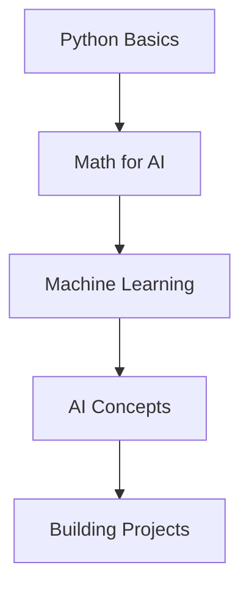

# 🌟 Soumik's Portfolio

  
  
  

---

## 👋 Hi, I'm Soumik!

Welcome to my personal portfolio!  
I'm a passionate high school student (Class 12) learning how Artificial Intelligence works, and building projects as I grow. This repo is a reflection of my journey, experiments, and discoveries in AI and tech.

---

## 🚀 My Goals

- 🌱 **Learn how AI works**
- 🛠️ **Build intelligent systems**
- 💡 **Explore new technologies**
- 🤝 **Connect and collaborate with other learners**

---

## 🧑‍💻 About Me

| Name    | Soumik          |
|---------|-----------------|
| Grade   | Class 12        |
| Focus   | AI & Machine Learning |
| Interests | Python, Maths, Creative Ideas |

---

## ✨ What You'll Find Here

- **Python projects & experiments**
- **Mini machine learning projects**
- **Notes & resources for learning**
- **My progress as I explore AI**

---

## 🔥 Learning Roadmap

---

## 🛠️ My Toolbox

---

## 📚 Current Focus

- Learning AI and ML fundamentals
- Building small projects
- Sharing my notes and progress

---

## 📫 Contact Me

- **GitHub:** [soumik183](https://github.com/soumik183)
- **Email:** soumikbairagi213@gmail.com  

---

## ⭐️ Acknowledgements

Thanks to all open source communities, teachers, and online resources helping me learn and grow!

---

  <em>
    "The best way to learn is by building and experimenting."
  </em>

 
